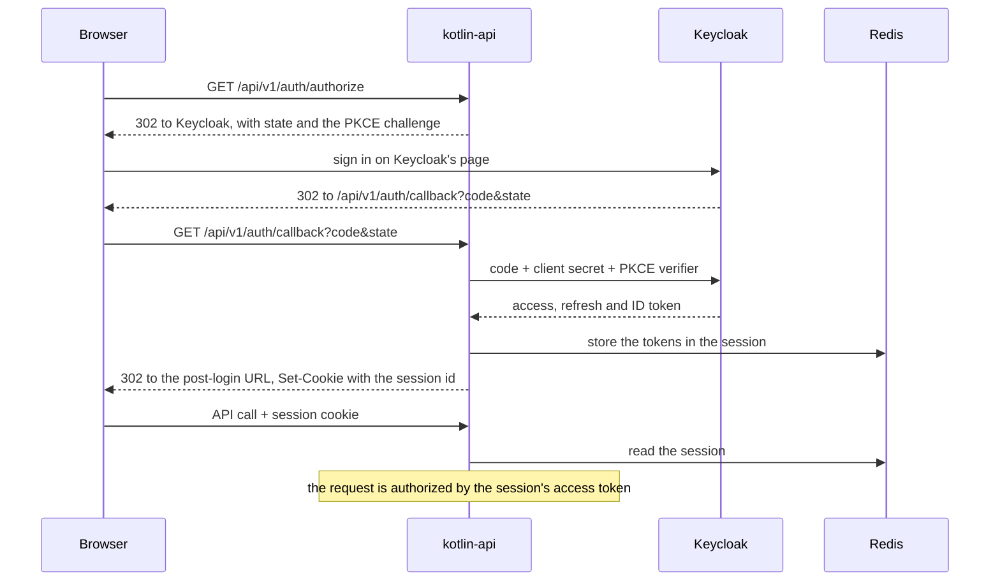

# Authentication

The application never handles a credential. Keycloak (realm `kotlin-api`) owns every page that touches one: sign-up,
sign-in, email verification, password reset, two-factor authentication and acceptance of the terms of use. The
application is a BFF: it runs the sign-in, keeps the tokens on the server and gives the browser only a session cookie.

## Signing in

1. The browser opens `GET /api/v1/auth/authorize`. `HostedSignInRequests` builds the authorization request with PKCE
   and redirects to Keycloak. Optional parameters pass through: `register=true` opens the sign-up page, and `kc_action`
   starts one of `CONFIGURE_TOTP`, `UPDATE_PASSWORD` or `delete_credential`. The browser's language picks Keycloak's
   language when it is `pl` or `en`.
2. Keycloak returns to `GET /api/v1/auth/callback`. Spring Security's OAuth2 client exchanges the code, using the
   confidential client `kotlin-api` and its secret, and stores the tokens in the HTTP session.
3. `SignInCompletion` decodes the access token, mirrors the account into PostgreSQL and redirects to
   `application.auth.post-login-url`. When the account cannot be written, or Keycloak issued no refresh token, it ends
   the Keycloak session again and redirects with `?error=sign_in_failed`; a lost or forged `state` gives
   `?error=state_mismatch`.

The browser holds only the `KOTLIN_API_SESSION` cookie: `HttpOnly`, `SameSite=Lax`, `Secure` outside the local profile.

## Every request is authorized by a token

The back-end is an OAuth2 resource server. It verifies the token's signature against Keycloak's published keys, its
issuer, its expiry and its audience (`kotlin-api`), and takes the roles from `realm_access.roles`, so `ADMIN` in
Keycloak becomes `ROLE_ADMIN` here.

A request carries the token in one of two ways:

| Caller                   | How                                                                                                   |
|--------------------------|-------------------------------------------------------------------------------------------------------|
| A browser with a session | `SessionAccessTokenFilter` takes the access token from the session and authorizes the request with it |
| A client of its own      | `Authorization: Bearer` with a token it obtained from Keycloak itself                                 |

Either way the decision rests on the token alone, not on the session, so any instance can serve any request.

## Sessions and refreshing

The session lives in Redis (Spring Session, namespace `kotlin-api:session`) and lasts ten hours. Access tokens live
five minutes, and the session's token is refreshed when less than a minute of it is left.

> [!IMPORTANT]
>
> Keycloak rotates refresh tokens: every refresh returns a new one and invalidates the old one, and replaying a spent
> one ends the session. Two requests of one session refreshing at once would therefore sign the user out.

A refresh therefore runs once per refresh token:

- within one instance, `SingleFlightRefreshTokenProvider` lets the first request refresh and hands its result to the
  others;
- across instances, `SharedRefreshes` takes a lock in Redis; the instance holding it refreshes and leaves the new tokens
  in Redis for 30 seconds, where the others pick them up. When Redis is unreachable an instance refreshes on its own, so
  Redis is never the reason a request fails.

When Keycloak refuses a refresh (`invalid_grant`), the session is invalidated and the next request is anonymous: a
blocked account or a revoked session stops working within five minutes.

## Signing out

`POST /api/v1/auth/logout` revokes the refresh token at Keycloak, which ends the Keycloak session, and invalidates the
local one.

## Cross-site requests

The cookie is `SameSite=Lax`, which keeps it off cross-site `POST`, `PUT`, `PATCH` and `DELETE`. `FetchMetadata` adds a
second check: an unsafe request whose `Sec-Fetch-Site` is neither `same-origin` nor `none` gets no token, and a logout
from another site is refused with `403`. CSRF tokens are therefore not used.

## Code

| Class                                                           | Role                                                          |
|-----------------------------------------------------------------|---------------------------------------------------------------|
| `config/SecurityConfig`                                         | the filter chain: OAuth2 login, resource server, public paths |
| `auth/AuthConfig`                                               | the client registration and the refresh chain                 |
| `auth/HostedSignInRequests`                                     | the authorization request: PKCE, sign-up, Keycloak actions    |
| `auth/SignInCompletion`                                         | mirroring the account after sign-in, and failed sign-ins      |
| `auth/SessionAccessTokenFilter`                                 | turning a session into a token-authorized request             |
| `auth/SingleFlightRefreshTokenProvider`, `auth/SharedRefreshes` | one refresh per refresh token                                 |
| `auth/KeycloakSessions`                                         | ending the Keycloak session                                   |

`HostedSignInTest`, `KeycloakIdentityTest` and `SharedRefreshesTest` cover the sign-in request, the identity read from a
token and the refresh across instances (on a Redis container).
